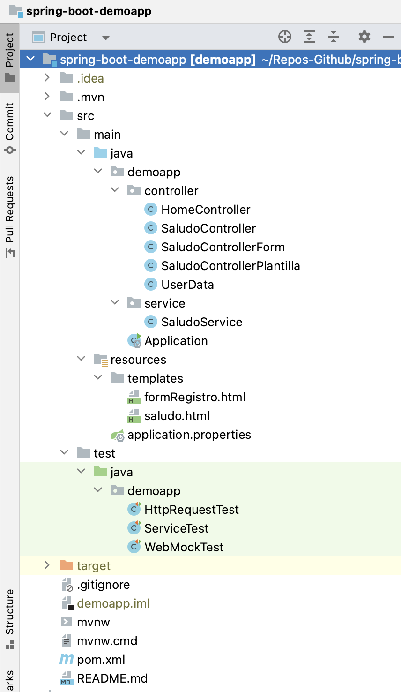
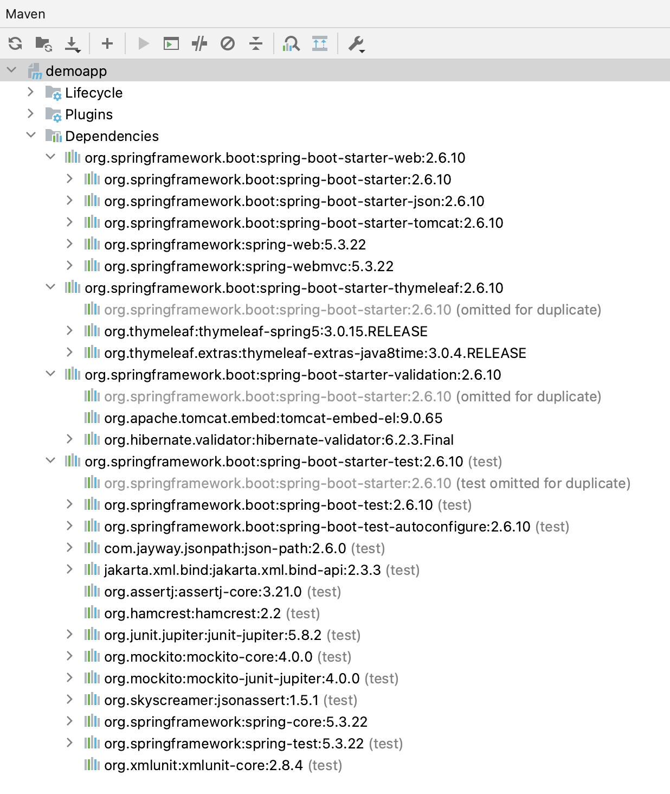
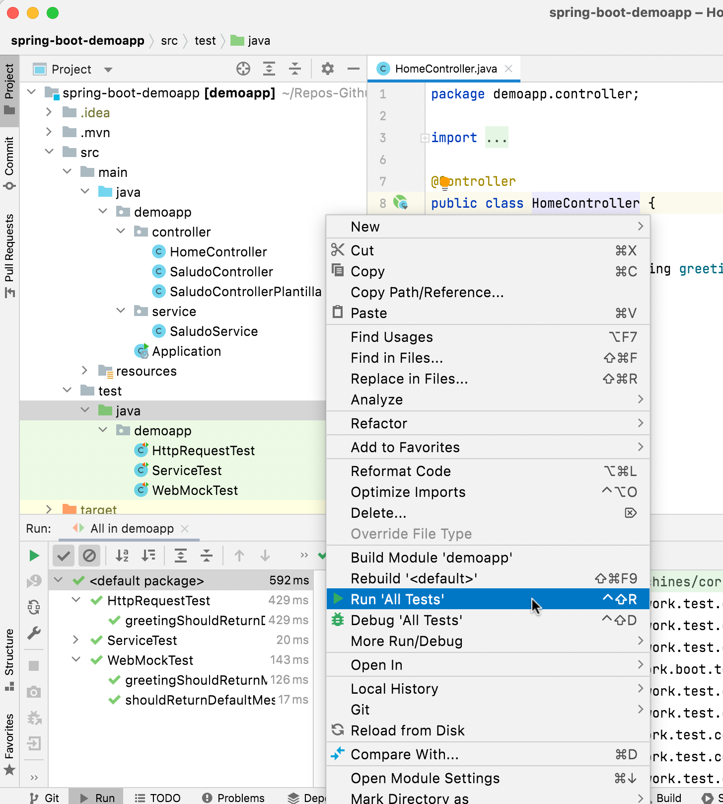

# Introducción a Spring Boot #

Vamos a trabajar con la versión 2.6.10 de Spring Boot. Se puede
consultar toda la documentación oficial sobre esta versión en [este
enlace](https://docs.spring.io/spring-boot/docs/2.6.10/reference/html/index.html). 

## 1. Aplicación ejemplo ##

Es muy sencillo crear aplicaciones de Spring Boot **desde cero** usando la
web [Spring initializr](https://start.spring.io). En esa página puedes
configurar los metadatos del proyecto y sus dependencias y descargar
el proyecto como un ZIP con la estructura de directorios y el POM
ya configurados. 

Nosotros vamos a hacerlo más fácil todavía usando una aplicación
ejemplo en GitHub
[domingogallardo/spring-boot-demoapp](https://github.com/domingogallardo/spring-boot-demoapp). 

La aplicación es un sencillo `Hola mundo`. En los siguientes apartados
explicamos cómo lanzarla y cómo funciona.

## 2. Ejecución de aplicaciones Spring Boot ##

Spring Boot permite ejecutar aplicaciones Spring de forma
_standalone_, sin necesidad de un servidor de aplicaciones. Una
aplicación Spring Boot lleva incluido un servidor web embebido
(Tomcat) que se pone en marcha al lanzar la aplicación y sirve todas
las páginas de la aplicación web.

Para lanzar una aplicación Spring Boot es suficiente tener instalados:

- JDK Java (8 en adelante)
- Maven

Maven incluso no es necesario si la aplicación Spring Boot lo tiene ya
instalado utilizando [Maven
Wrapper](https://github.com/takari/maven-wrapper), como es el caso de
la aplicación ejemplo.

Desde el directorio donde está la aplicación que queremos lanzar
podemos arrancarla como una aplicación Java. Podemos llamar a `mvn` si
tenemos instalado Maven o a `./mvnw` para usar Maven Wrapper:

```
$ ./mvnw package
$ java -jar target/demoapp-0.0.1-SNAPSHOT.jar 
```

También podemos lanzarla usando el plugin `spring-boot` de Maven:

```
$ ./mvnw spring-boot:run
```

La aplicación se arranca por defecto en el puerto local 8080. Una vez
arrancada la aplicación podemos conectarnos desde un navegador a sus
páginas de inicio.

En el caso de la aplicación demo descargada, podemos probar las
siguientes páginas:

- [http://localhost:8080](http://localhost:8080)
- [http://localhost:8080/saludo/Pepito](http://localhost:8080/saludo/Pepito)
- [http://localhost:8080/saludoplantilla/Pepito](http://localhost:8080/saludoplantilla/Pepito)
- [http://localhost:8080/saludoform](http://localhost:8080/saludoform)

## 3. Desarrollo y ejecución con IntelliJ ##

Recomendamos hacer el desarrollo usando el IDE [IntelliJ
Ultimate](https://www.jetbrains.com/idea/download/). Aunque es de
pago, es posible [obtener una licencia de
estudiante](https://www.jetbrains.com/shop/eform/students) usando la
dirección de correo de la UA.

Para abrir un proyecto Spring Boot en IntelliJ basta con
abrir el directorio donde se encuentre el fichero `pom.xml`. Se
puede hacer desde la pantalla de bienvenida de IntelliJ con la opción
**Open** o usando la opción **File > Open"** o **"File > New > Project from
Existing Sources**. 

IntelliJ abre el proyecto correctamente:



Podemos ejecutarlo abriendo un terminal y lanzándolo con Maven. O
también desde la **configuración de Run** que ha creado IntelliJ al
realizar la importación:


Se abrirá un panel de ejecución desde el que se puede parar la
aplicación, volverla a lanzar, etc:


## 4. Conceptos de Spring Boot ##

### Estructura de la aplicación ###

Estructura de directorios típica de los proyectos Java construidos con
Maven:


El fichero `pom.xml` declara las dependencias. Spring Boot proporciona
_starters_ que agrupan un conjunto de dependencias comunes.

**Fichero `pom.xml`**

```xml
<?xml version="1.0" encoding="UTF-8"?>
<project xmlns="http://maven.apache.org/POM/4.0.0"
         xmlns:xsi="http://www.w3.org/2001/XMLSchema-instance"
         xsi:schemaLocation="http://maven.apache.org/POM/4.0.0
         https://maven.apache.org/xsd/maven-4.0.0.xsd">
    <modelVersion>4.0.0</modelVersion>

    <groupId>es.ua.mads</groupId>
    <artifactId>demoapp</artifactId>
    <version>0.0.1-SNAPSHOT</version>
    <name>demoapp</name>

    <parent>
        <groupId>org.springframework.boot</groupId>
        <artifactId>spring-boot-starter-parent</artifactId>
        <version>2.6.10</version>
    </parent>

    <properties>
        <java.version>1.8</java.version>
    </properties>

    <dependencies>
        <dependency>
            <groupId>org.springframework.boot</groupId>
            <artifactId>spring-boot-starter-web</artifactId>
        </dependency>
        <dependency>
            <groupId>org.springframework.boot</groupId>
            <artifactId>spring-boot-starter-thymeleaf</artifactId>
        </dependency>
        <dependency>
            <groupId>org.springframework.boot</groupId>
            <artifactId>spring-boot-starter-validation</artifactId>
        </dependency>
        <dependency>
            <groupId>org.springframework.boot</groupId>
            <artifactId>spring-boot-starter-test</artifactId>
            <scope>test</scope>
        </dependency>
    </dependencies>

    <build>
        <plugins>
            <plugin>
                <groupId>org.springframework.boot</groupId>
                <artifactId>spring-boot-maven-plugin</artifactId>
            </plugin>
            <plugin>
                <groupId>org.apache.maven.plugins</groupId>
                <artifactId>maven-surefire-plugin</artifactId>
                <configuration>
                    <argLine>-Dfile.encoding=UTF8</argLine>
                </configuration>
            </plugin>
        </plugins>
    </build>

</project>
```

En el panel de Maven de IntelliJ se puede consultar las librerías concretas que
se han descargado:



En el fichero de configuración de la aplicación se definen propiedades
que configuran distintos aspectos de la misma, como la base de datos
con la que se va a trabajar o el puerto en el que debe
ejecutarse. Conforme necesitemos configurar estas propiedades iremos
añadiendo elementos al fichero.

**Fichero `resources/application.properties`**

```
spring.application.name = demoapp
```


### Controladores ###

Los controladores definen el código a ejecutar como respuesta a una
petición HTTP. Son clases que se suelen colocar en el paquete
`controller` y están anotadas con `@Controller`.

Vemos un ejemplo en la clase `SaludoController`.

**Fichero `src/main/java/demoapp/controller/SaludoController.java`**:

```java
package demoapp.controller;

import demoapp.service.SaludoService;
import org.springframework.beans.factory.annotation.Autowired;
import org.springframework.stereotype.Controller;
import org.springframework.web.bind.annotation.PathVariable;
import org.springframework.web.bind.annotation.RequestMapping;
import org.springframework.web.bind.annotation.ResponseBody;


@Controller
public class SaludoController {

    @Autowired
    private SaludoService service;

    @RequestMapping("/saludo/{nombre}")
    public @ResponseBody String saludo(@PathVariable(value="nombre") String nombre) {
        return service.saluda(nombre);
    }

}
```

Los métodos en los que se definen las respuestas a las peticiones HTTP
están anotados con anotaciones en las que se indica el tipo de
petición y la URL a la que se responde.

Por ejemplo, en la clase anterior el método `saludo` contesta a las
peticiones dirigida a la URL `/saludo/Ana`. La cadena `Ana` en la URL
es decodificada y pasada en el parámetro `nombre` al método.

El método devuelve la respuesta HTTP. La anotación `@ResponseBody`
construye automáticamente esta respuesta, añadiendo como contenido de
la misma la cadena devuelta por el servicio. 

En este caso la respuesta es:

```
HTTP/1.1 200 
Content-Type: text/plain;charset=UTF-8
Content-Length: 8
Date: Mon, 02 Sep 2019 14:59:04 GMT

Hola Ana
```


### Clases de Servicio ###

Es recomendable definir clases de servicio en las que se implementa la
lógica de negocio de la aplicación. Las clases _controller_ llaman a las
clases servicio, que son las que realmente realizan todo el
procesamiento.

De esta forma se separan las responsabilidades. Las clases _controller_
se encargan de procesar las peticiones y las respuestas HTTP y las
clases de servicio son las que realmente realizan la lógica de negocio
y devuelven el contenido de las respuestas. Si en algún momento hay
que añadir una nueva capa de presentación en la que, por ejemplo, se
trabaje con objetos JSON, no será necesario cambiar la capa de
servicios, sólo añadir nuevas clases _controller_.

La separación de la lógica de negocio en las clases de servicio
permite también realizar tests que trabajan sobre objetos Java,
independientes de los formatos de entrada/salida manejados por los
controladores. 

**Fichero `src/main/java/demoapp/service/SaludoService.java`**

```java
package demoapp.service;

import org.springframework.stereotype.Service;

@Service
public class SaludoService {
    public String saluda(String nombre) {
        return "Hola " + nombre;
    }
}
```


### Inyección de dependencias en Spring ###

Spring Boot utiliza la anotación `@Autowired` para inyectar en la
variable anotada un objeto nuevo del tipo indicado. Se puede definir
la anotación en la variable o en el constructor de la clase. Hemos
utilizado la anotación en las variables de instancia.

En los ejemplos anteriores podemos comprobar estas anotaciones. En la
aplicación ejemplo se define un controlador y un servicio que devuelve
un saludo. El servicio se anota con la anotación `@Service` y esta
anotación le indica a Spring Boot que la clase que va a poder ser
inyectada.

En el controlador se necesita instanciar un objeto de la clase
`SaludoService` y se hace usando inyección de dependencias. Spring
Boot se encarga de obtener una instancia y de inyectarla en la
variable cuando se inicializa el controlador. Lo vemos en el siguiente código:

```java
@Controller
public class SaludoController {

    @Autowired
    private SaludoService service;

    @RequestMapping("/saludo/{nombre}")
    public @ResponseBody String saludo(@PathVariable(value="nombre") String nombre) {
        return service.saluda(nombre);
    }

}
```

Mediante la inyección de dependencias el código es más flexible y es
más fácil de testear, pudiéndose definir _mocks_ que sustituyen los
objetos inyectados.

Más información en la documentación de Spring Boot [Spring Beans and Dependency Injection](https://docs.spring.io/spring-boot/docs/2.1.16.RELEASE/reference/htmlsingle/#using-boot-spring-beans-and-dependency-injection).

#### Alcance de los objetos inyectados ####

Por defecto el alcance (_scope_) de todas las anotaciones de Spring (`@service`,
`@controller`, `@component`, etc.) es un _Singleton_. Existe una única
instancia de ese objeto que es la que se inyecta en las variables.

Al estar funcionando en una aplicación web, el _singleton_ que hace de
controlador recibirá múltiples peticiones concurrentemente. Cada
petición irá en su propio hilo de Java, por lo que múltiples hilos
podrán estar ejecutando el mismo código del controlador. 

Por ello hay que tener cuidado en **no definir variables de instancia
mutables (con estado)** dentro del controlador (con excepción de los
objetos inyectados con la anotación `@Autowired`), porque podrían
producirse errores debidos a condiciones de carrera (un hilo modifica
la misma variable que otro está leyendo). Es conveniente que todos los
_beans_ (controladores, servicios, etc.) sean objetos sin estado.

También es posible definir otros alcances, como `@RequestScope` o
`@SessionScope`. En el primer caso se crea una instancia nueva del
objeto para cada petición HTTP y en el segundo se crea una instancia
nueva en cada sesión HTTP.

Puedes encontrar más información y ejemplos en [este enlace](https://www.baeldung.com/spring-bean-scopes).

### Plantillas Thymeleaf ###

Las páginas HTML devueltas se pueden construir
utilizando un lenguaje de plantillas con el framework
[Thymeleaf](https://www.thymeleaf.org/doc/tutorials/3.0/usingthymeleaf.html). Las
plantillas thymeleaf son páginas HTML en las que se introducen objetos
Java pasados por los controllers.

Las plantillas se incluyen en el directorio `resources/templates`.

Por ejemplo, el siguiente fichero es una sencilla plantilla que
muestra un saludo. El objeto `mensaje` es una cadena que se pasa desde
el controller.

**Fichero `src/main/resources/templates/saludo.html`**

```HTML
<!DOCTYPE html>
<html xmlns:th="http://www.thymeleaf.org">
    <h1 th:text="'Saludo: ' + ${mensaje}"> </h1>
</html>
```

El controller construye la vista devolviendo el nombre de la
plantilla. Y pasa a la plantilla los objetos a mostrar usando un
diccionario (la variable `model` que recibe como parámetro):

**Fichero `src/main/java/demoapp/controller/SaludoControllerPlantilla.java`**

```java
package demoapp.controller;

import demoapp.service.SaludoService;
import org.springframework.beans.factory.annotation.Autowired;
import org.springframework.stereotype.Controller;
import org.springframework.ui.Model;
import org.springframework.web.bind.annotation.PathVariable;
import org.springframework.web.bind.annotation.RequestMapping;


@Controller
public class SaludoControllerPlantilla {

    @Autowired
    private SaludoService service;

    @RequestMapping("/saludoplantilla/{nombre}")
    public String saludo(@PathVariable(value="nombre") String nombre, 
                                                       Model model) {
        // Se añade la respuesta a la clave 'mensaje' que se usa
        // en la plantilla
        model.addAttribute("mensaje", service.saluda(nombre));
        // Se llama a la plantilla 'saludo.html'
        return "saludo";
    }
}
```

### Formularios y validación ###

Spring Boor simplifica la declaración y validación de formularios
usando clases Java que trabajan como modelos del formulario. Por
ejemplo, en la aplicación se define la clase `UserData`:

**Fichero `src/main/java/demoapp/controller/UserData.java`**

```java
package demoapp.controller;

import javax.validation.constraints.Size;

public class UserData {
    @Size(min=3, max=30)
    String nombre;

    public void setNombre(String nombre) {
        this.nombre = nombre;
    }

    public String getNombre() {
        return nombre;
    }
}
```

Se trata de un objeto con el campo `nombre` de tipo `String` al que se
le ha añadido una anotación de validación `@Size` con el tamaño mínimo y
máximo que debe tener.

Puedes encontrar más información sobre otros atributos de validación
en [este enlace](https://www.baeldung.com/javax-validation).

El formulario HTML propiamente dicho se define con una plantilla
thymeleaf en la que se declara un objeto que tiene el mismo nombre que
el nombre de la clase modelo, pero con la primera letra en
minúscula. En nuestro caso la clase modelo es `UserData`, por lo que el objeto
del formulario debe llamarse `userData`. En el formulario podemos usar
cualquier campo definido en el objeto modelo. En nuestro caso usamos
el único campo de tipo `String`, `nombre`.

**Fichero `src/main/resources/templates/formRegistro.html`**

```html
<!DOCTYPE HTML>
<html xmlns:th="http://www.thymeleaf.org">
<body>
<form th:action="@{/saludoform}" th:object="${userData}" method="post">
    <table>
        <tr>
            <td>Nombre:</td>
            <td><input type="text" th:field="*{nombre}" /></td>
            <td th:if="${#fields.hasErrors('nombre')}" th:errors="*{nombre}"></td>
        </tr>
        <tr>
            <td><button type="submit">Enviar</button></td>
        </tr>
    </table>
</form>
</body>
</html>
```

Se define una acción que enviará una petición `POST` a la URL
`/saludoform` con los datos del formulario. En este caso el nombre.

Por último, el controller que lanza el formulario y el que recibe la
petición `POST` con los datos introducidos se definen en el siguiente
fichero:

**Fichero `src/main/java/demoapp/controller/SaludoControllerForm.java`**

```java
package demoapp.controller;

import demoapp.service.SaludoService;
import org.springframework.beans.factory.annotation.Autowired;
import org.springframework.stereotype.Controller;
import org.springframework.ui.Model;
import org.springframework.validation.BindingResult;
import org.springframework.web.bind.annotation.*;

import javax.validation.Valid;

@Controller
public class SaludoControllerForm {

    @Autowired
    private SaludoService service;

    @GetMapping("/saludoform")
    // Hay que declarar un parámetro con el tipo usado en el modelo del formulario (UserData)
    public String saludoForm(UserData userData) {
        return "formRegistro";
    }

    @PostMapping("/saludoform")
    public String checkPersonInfo(@ModelAttribute @Valid UserData userData, BindingResult bindingResult, Model model) {
        if (bindingResult.hasErrors()) {
            return "formRegistro";
        }
        model.addAttribute("mensaje", service.saluda(userData.getNombre()));
        return "saludo";
    }
}
```

El método que recibe la petición en `/saludoform` simplemente devuelve
la plantilla con el formulario. 

Y el método que recibe los datos es el que responde a la petición
`POST` en la URL `/saludoform` recibe los datos del formulario en un
objeto Java del tipo del modelo del formulario (el parámetro
`userData`). Las anotaciones `@ModelAttribute` y `@Valid` indican que
es un objeto recogido en el formulario sobre el que se ha realizado
una validación. Se detecta si ha habido algún error en el método
`hasErrors()` del `bindingResult` que se recibe también como
parámetro. 

Si ha habido error, se vuelve a devolver el formulario para
que se vuelva a completar. Si no ha habido error se obtiene el nombre
introducido en el formulario y se pasa a la plantilla del saludo.

### Tests ###

A partir de Spring Boot 2.4 se usa JUnit 5 como librería de tests.

En la aplicación de demostración hay varios ejemplos que muestran
posibles formas de realizar pruebas en una aplicación Spring Boot.

Spring Boot incluye el framework
[AssertJ](https://assertj.github.io/doc/) que permite realizar
expresiones de prueba con un lenguaje muy expresivo.

Los tests se pueden ejecutar usando el comando típico de Maven:

```
$ mvn test
```

O también, usando el comando de Maven Wrapper:

```
$ ./mvnw test
```

También se pueden lanzar desde el propio IntelliJ, pulsando en el
panel del proyecto sobre el directorio de tests con el botón
derecho. Los tests se lanzarán y aparecerá un panel en el que se
mostrará si pasan correctamente (verde) o no.




#### Tests sobre clases de servicio ####

Podemos realizar pruebas sobre la capa de servicio, obteniendo una
instancia del servicio mediante inyección de dependencias.

En el siguiente ejemplo se muestra cómo se prueba el método de
servicio `saluda`.

**Fichero `src/test/java/demoapp/ServiceTest.java`**

```java
package demoapp;

import demoapp.service.SaludoService;
import org.junit.jupiter.api.Test;
import org.springframework.beans.factory.annotation.Autowired;
import org.springframework.boot.test.context.SpringBootTest;
import static org.assertj.core.api.Assertions.assertThat;

@SpringBootTest
public class ServiceTest {

    @Autowired
    SaludoService saludo;

    @Test
    public void contexLoads() throws Exception {
        assertThat(saludo).isNotNull();
    }

    @Test
    public void serviceSaludo() throws Exception {
        assertThat(saludo.saluda("Domingo")).isEqualTo("Hola Domingo");
    }
}
```


#### Tests sobre capa web ####

Es posible realizar tests sobre la capa de presentación sin lanzar
realmente el servidor web ni ejecutar realmente las peticiones
HTTP. Se obtiene por inyección de dependencias un _mock_ de
la clase `MockMvc` y se usan métodos como `perform(get("/"))` o
`perform(post("/saludoform").param("nombre", "Domingo"))`.

En el primer test del ejemplo siguiente se comprueba que una petición
`GET` a la URL `/` devuelve un código HTTP OK (200) y una página HTML
con la cadena esperada.

En este test lo único que se moquea es el servidor web, y se ejecuta
el código real del servicio, del controlador y de la plantilla.

Se utilizan los métodos `andDo` y `andExpect` de la propia librería de
testeo de Spring Framework y el método `conteainsString` de la
librería de testeo [Hamcrest](http://hamcrest.org/JavaHamcrest/tutorial).

En el segundo test se realiza una petición `POST` para comprobar que
el formulario funciona correctamente.

**Fichero `src/test/demoapp/MockMvcTest.java`**

```java
package demoapp;

import org.junit.jupiter.api.Test;
import org.springframework.beans.factory.annotation.Autowired;
import org.springframework.boot.test.autoconfigure.web.servlet.AutoConfigureMockMvc;
import org.springframework.boot.test.context.SpringBootTest;
import org.springframework.test.web.servlet.MockMvc;

import static org.hamcrest.Matchers.containsString;
import static org.springframework.test.web.servlet.request.MockMvcRequestBuilders.get;
import static org.springframework.test.web.servlet.request.MockMvcRequestBuilders.post;
import static org.springframework.test.web.servlet.result.MockMvcResultMatchers.content;
import static org.springframework.test.web.servlet.result.MockMvcResultMatchers.status;

@SpringBootTest
@AutoConfigureMockMvc
public class MockMvcTest {

    @Autowired
    private MockMvc mockMvc;

    // Hacemos una petición GET a un end point y comprobamos que
    // el HTML resultante es correcto
    @Test
    public void shouldReturnDefaultMessage() throws Exception {
        this.mockMvc.perform(get("/"))
                .andExpect(status().isOk())
                .andExpect(content().string(containsString("Hello World")));
    }

    // Podemos hacer también una petición POST y pasar los datos
    // del formulario con el método .param
    @Test
    public void postShoudReturnCorrectResponse() throws Exception {
        this.mockMvc.perform(post("/saludoform")
                .param("nombre", "Domingo"))
                .andExpect(status().isOk())
                .andExpect(content().string(containsString("Hola Domingo")));
    }
}
```

También es posible realizar un test únicamente del controlador y la
plantilla de presentación, moqueando el servicio. Se muestra en el
fichero `MockServiceTest`.

**Fichero `src/test/demoapp/MockServiceTest.java`**

```java
package demoapp;

import demoapp.service.SaludoService;
import org.junit.jupiter.api.Test;
import org.springframework.beans.factory.annotation.Autowired;
import org.springframework.boot.test.autoconfigure.web.servlet.AutoConfigureMockMvc;
import org.springframework.boot.test.context.SpringBootTest;
import org.springframework.boot.test.mock.mockito.MockBean;
import org.springframework.test.web.servlet.MockMvc;

import static org.hamcrest.Matchers.containsString;
import static org.mockito.Mockito.when;
import static org.springframework.test.web.servlet.request.MockMvcRequestBuilders.get;
import static org.springframework.test.web.servlet.request.MockMvcRequestBuilders.post;
import static org.springframework.test.web.servlet.result.MockMvcResultMatchers.content;
import static org.springframework.test.web.servlet.result.MockMvcResultMatchers.status;

@SpringBootTest
@AutoConfigureMockMvc
public class MockServiceTest {

    @Autowired
    private MockMvc mockMvc;

    // Podemos también mockear el servicio
    @MockBean
    private SaludoService service;

    @Test
    public void greetingShouldReturnMessageFromService() throws Exception {

        // Y especificar lo que debe devolver una llamada a uno de sus métodos
        when(service.saluda("Domingo")).thenReturn("Hola Mock Domingo");

        this.mockMvc.perform(get("/saludo/Domingo"))
                .andExpect(status().isOk())
                .andExpect(content().string(containsString("Hola Mock Domingo")));
    }
}
```

## 5. Referencias ##

Puedes encontrar la documentación de referencia de Spring Boot y
Spring en las siguientes páginas, en la pestaña _Learn_:

- [Spring Boot](https://spring.io/projects/spring-boot)
- [Spring](https://spring.io/projects/spring-framework) 

También podemos encontrar también una extensa cantidad de tutoriales y guías
rápidas en la web de Spring, en la url
[https://spring.io/guides](https://spring.io/guides).

En concreto, hemos usado las siguientes referencias para construir
esta primera aplicación ejemplo:

- [Building an Application with Spring Boot](https://spring.io/guides/gs/spring-boot/)
- [Serving Web Content with Spring  MVC](https://spring.io/guides/gs/serving-web-content/)
- [Handling Form Submission](https://spring.io/guides/gs/handling-form-submission/)
- [Validating Form Input](https://spring.io/guides/gs/validating-form-input/)
- Spring Boot Reference Guide 2.6.10
  ([HTML](https://docs.spring.io/spring-boot/docs/2.6.10/reference/htmlsingle/), [PDF](https://docs.spring.io/spring-boot/docs/2.6.10/reference/pdf/spring-boot-reference.pdf))
  
